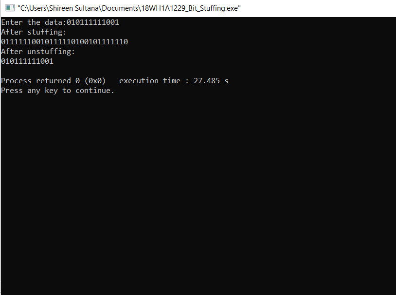

# Experiment 1 - Bit Stuffing

## AIM:To implement Bit Stuffing,one of the data link layer framing methods.

## PROCEDURE:
## 1.Start
## 2.Initialize the array for transmitted stream with the special bit pattern 01111110 which indicates the beginning of the frame
## 3.Get the bit stream to be transmitted in to the array
## 4.Check for five consecutive ones and if they occur,stuff a bit 0
## 5.Display the data transmitted as it appears on the data line after appending 01111110 at the end
## 6.For De-stuffing,copy the transmitted data to another array after detecting the stuffed bits
## 7.Display the received bit stream
## 8.Stop

### Output:

