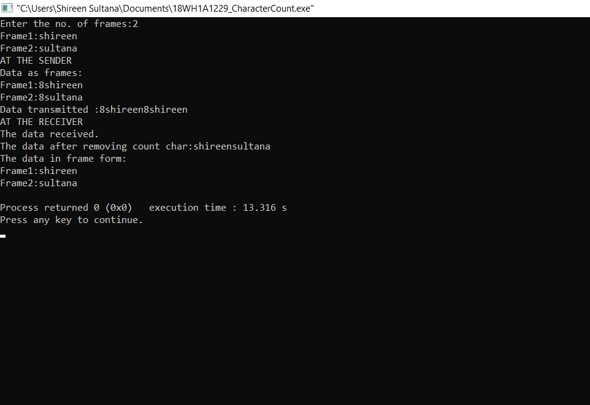

# Experiment 1 - Character Count

## AIM: To implement the data link layer method Character Stuffing

## PROCEDURE:
## 1.Start
## 2.Read the number of frames given as input
## 3.Now read the frames one by one
## 4.Append the number greater then the lenght of frame at the beginning of the frame
## 5.This data is transferred to the receiver
## 6.At the receiver end read the transmitted data 
## 7.Remove the appended number at the beginning of the frame 
## 8.Print the rest of the data as Received data

### OUTPUT:

