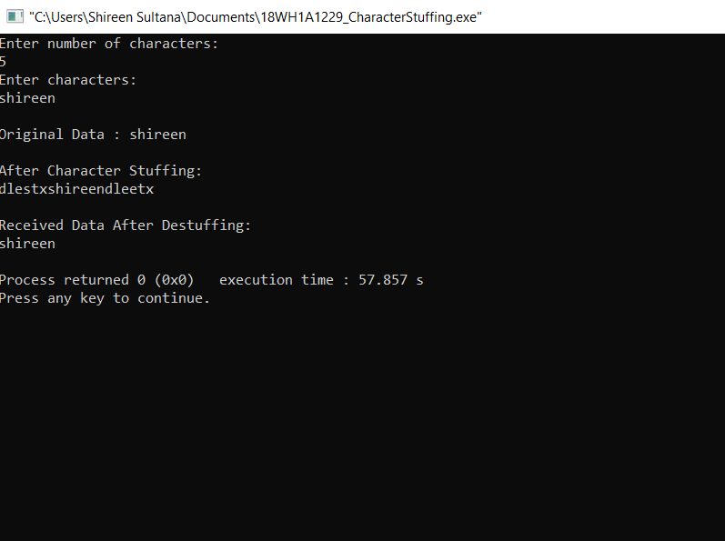

# Experiment 1 - Character Stuffing

## AIM: Implement the data link layer framing method such as Character Stuffing.

## PROCEDURE: 
## 1.Start
## 2.Append DLE STX at the beginning of the string
## 3.Check the data if characters is present;if character DLE is present in the string insert another DLE in the string 
## 4.Transmit DLE ETX at the end of the string 
## 5.Display the string 
## 6.While De-stuffing Neglect initial DLE STX
## 7.If DLE is present in the text,neglect it;if another DLE follows,copy the same to output.
## 8.Neglect the trailing DLE ETX
## 9.Stop

### OUTPUT:

