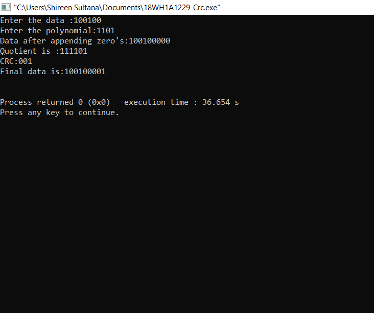

# Experiment2

## AIM:To compute CRC code for the polynomials CRC-12, CRC-16 and CRC CCIP

## PROCEDURE:
### 1. Read the Frame
### 2. Read the generator polynomial
### 3. Find out the degree of the generator polynomial
### 4. Append the number of the zero's to the frame,that number is equal to the degree of the polynomial
### 5. Find out number of digits in the generator polynomial
### 6. Repeat the following until the number of digits are exhausted
### 7. If the frame is starting with 1,then exclusive-or the frame with generator
### 8. Check whether the result obtained in step 7 is starting with 1,if so exclusive-or the remainder with the generator
### 9. If the result obtained in step7 is starting with 0,then exclusive-or the remainder(result) with zeros.The number of zeroes must be equal to the lenght of the generator.

### Output:

