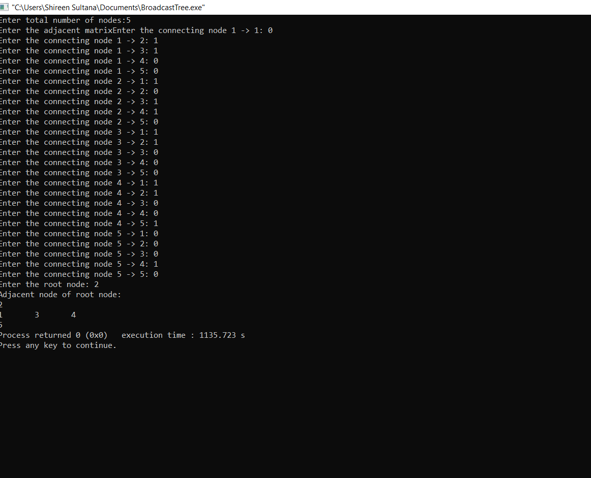

# Experiment 5
## AIM:
### Write a c program by taking a example subnet of hosts and obtain a broadcast tree for the subnet.
## PROCEDURE:
### 1.Start
### 2.Read the number of nodes in the network
### 3.Read the adjacency matrix .If there is a edge between the nodes represent with 1 otherwise 0
### 4.Enter the root node(Root node is the source node from where the packet will be sent)
### 5.Print all the nodes that are adjacency to the root node
### 6.To print all the adjacency nodes to the given root node follow the procedure as-
### Suppose k is the root node,
### Then compare each node in the network with k (adjacent means 1 otherwise 0)
### if(a[k][j]==1 || a[j][k]==1)
### printf("%d\t",j);
### 7.Repeat the above step until all the nodes in the network are exhausted
### 8.Print all the adjacent nodes to the given root node
### 9.Print the node that is not adjacent to the given root node
### if((a[k][j]==0)&&(a[i][k]==0)&&(i!=k))
### 10.Stop
## OUTPUT:

