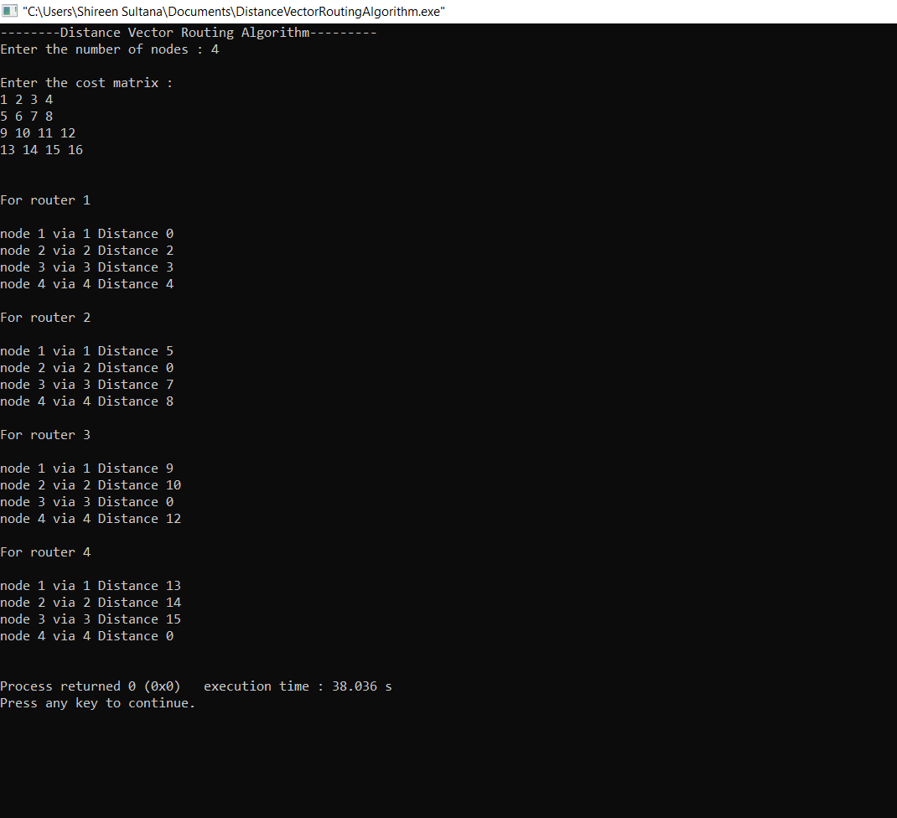

# Experiment 6
## AIM:
### To implement Distance Vector Routing Algorithm
## PROCEDURE:
### At each node x,
### INITIALIZATION
### For all destination y in N:Dx = c(x,y)//if y is not a neighbour then c(x,y) = infinity for each neighbour wDw(y) = ? for all destination y in N.for each neighbour w send distance vector Dx = [Dx(y):y in N] to w
### lOOP
### wait(until I receive any distance vector from some neighbour w)for each y in N:Dx(y) = minv{c(x,v)+Dv(y)}.If Dx(y) is changed for any destination y send distance vector Dx = [Dx(y):y in N] to all neighbours.
## OUTPUT:

