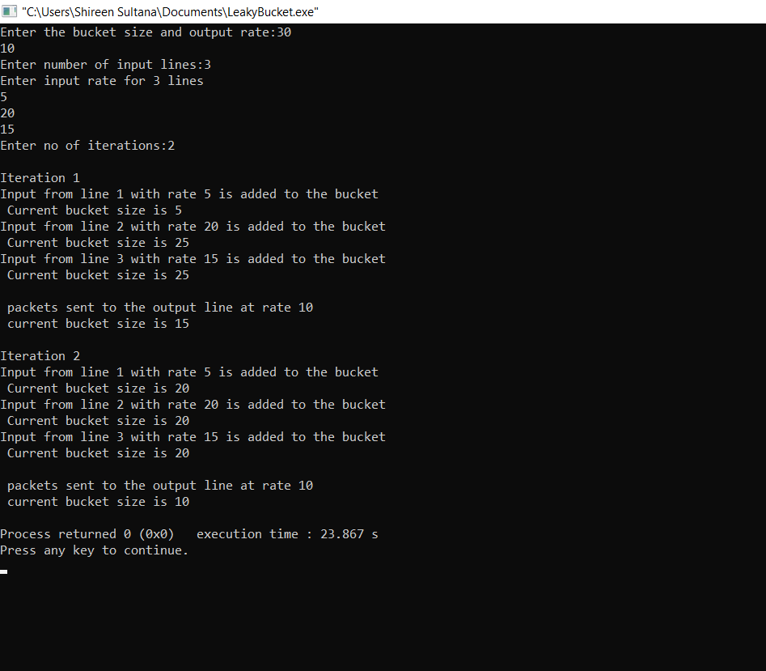

# Experiment 8
## AIM:
### To implement Congestion control using Leaky Bucket Algorithm
## PROCEDURE:
### 1.Start
### 2.Set the Bucket size or the buffer size
### 3.Set the Output rate
### 4.Transmit the packets such that there is no overflow
### 5.Repeat the process of transmission until all packets are transmitted.(Reject packets where its size is greater than the bucket size)
### 6.Stop
## Output:

