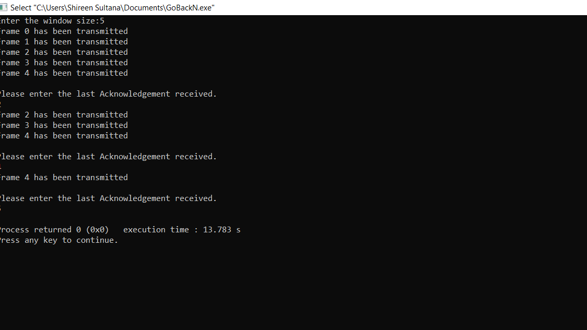

# Experiment 3
## AIM:
### Write a c program to develop a simple data link layer that performs loss recovery using the GoBackN mechanism.
## PROCEDURE:
## Go-Back-N
### In Go-Back-N ARQ,N is the senders window size.Suppose we say that Go-Back-3,which means that three frames can be sent at a time before expecting the aknowledgement from the receiver.
### In Go-Back-N ARQ the frames are been numbered sequentially as Go-Back-N ARQ sends the multiple frames at a time that requires the numebering approach to distinguish the frame from,and these numbers are known as the sequential numbers.
### 1.Firstly,the sender will send the first n(window size)frames to the receiver,and now the sender is expected to receive the acknowledgement of the 0th frame.
### 2.Once the transfer of window size is completed,the sender receives the acknowledgement of the first frame,ie.packet no1.As the acknowledgement receives,the sender sends the next packet.
### 3.Now,the sender receives the acknowledgement of packet .After receiving the acknowledgement of packet 2,the sender sends the next packet.By repeating these steps we conclude the total transimission required.
## OUTPUT:

