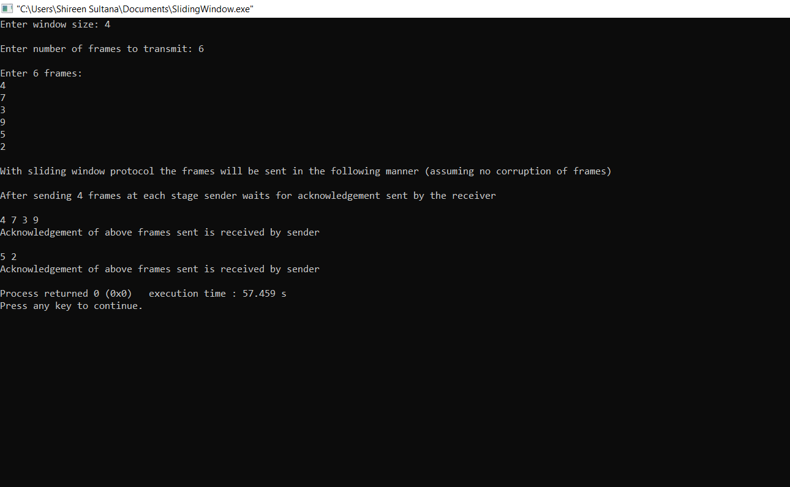

# Experiment 3
## AIM:
### Write a ac program to develop a simple data link layer that performs the flow control using the sliding window protocol.
## PROCEDURE:
## Sliding window protocol
### Sliding window protocols are data link layer protocols for reliabe and sequential delivery of data frames.In this protocol multiple frames can be send by sender at a time before receiving an acknowledgment from receiver.
### In these protocols, the sender has a buffer called the sending window and the receiver has buffer called the receiving window. The size of the sending window  determines the sequence number of the outbound frames. If the sequence number of the frames is an n-bit field,then the  range of sequence numbers that can that can be assigned is 0 to 2n-1 consequently the size of the sending window is 2n-1.Thus is order to accommodate a sending window size of size of 2n-1,a n-bit sequence number is chosen.
## OUTPUT:

